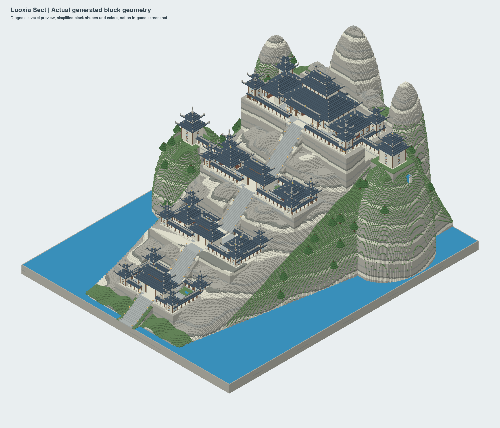

# 修仙模组系列（暂名）

### 术法装配与施法

胎息通用术法分为两类：前十门在进入胎息境界后自动领悟，后十门必须通过奇遇获得对应的术法书。术法书只能右键研读，不通过炼丹或合成获得；研读结果会写入玩家修行数据并随存档保存。

按 `G` 打开术法装配界面。界面提供四个装配槽、可用术法列表和完整的属性、真气消耗、冷却、范围及效果说明。选择槽位后点击术法即可发送装配请求，服务端会再次校验境界、当前功法、术法书和重复装备。

鼠标中键短按会施放当前选中的术法；长按约 0.18 秒会打开四向轮盘，移动鼠标悬浮选择方向，松开中键施放选中的术法，滚轮也可以在轮盘中切换槽位。所有施法仍由服务端扣除真气、处理冷却和目标判定。

新增术法或术法书时，请同时更新 `CultivationSpells`、`XiuxianItems`、中文语言文件和本 README。术法书 ID 应加入奇遇术法集合，术法强度保持在胎息阶段可控范围内。

一个以中国传统修行为主题的 Minecraft Java 版模组系列。计划先做出可独立游玩的修行核心，再逐步扩展丹道、功法道法、法宝与修行世界，最后整理成完整的修行主题整合包。

项目正在开发修行核心原型。方向和开发顺序见[项目规划](docs/PROJECT_PLAN.md)。

## 当前原型

- 首次进入世界时，在中央身份界面选择家族出身与修行身份；确认前无法移动、交互或受到伤害。尚未选择时可用 `/xiuxian identity` 重新打开界面。
- 身份界面目前带有简短的世界引子；完整世界观、正式美术和开场剧情仍待完善。
- 确立身份后成为人类角色，并获得入门功法“吐纳引气诀”；开局不送成丹。
- 按 `M` 盘坐入定或结束打坐；行功时锁定在原地，受击会中断，每约 8 秒积累一点修为。命令 `/xiuxian meditate` 仍可使用。
- 输入 `/xiuxian status` 查看身份、功法、境界和修为，达到需求后使用 `/xiuxian breakthrough` 突破。
- 按 `B` 尝试突破，按 `K` 打开修行档案；按键可在“选项-控制-修行”中更改。
- 气血与修为 HUD 位于快捷栏两侧；打开物品栏时移到物品栏左右。
- 打开物品栏后，点击“修行”按钮或按 `K` 查看境界、身份、四项资质和实际战斗属性。
- 灵根、根骨、悟性、气运会在身份确认时按家族出身与修行身份随机生成；它们分别影响吐纳效率、承伤和突破需求。
- 主世界地下生成四档灵石矿，每区块平均尝试生成下品 5 条、中品 0.6 条、上品 0.125 条、极品 0.021 条；按矿脉尺寸估算的目标矿石块比例约为 89.8% / 9.0% / 1.1% / 0.1%。实际数量会受地形替换和空气暴露过滤影响。下品需石镐、中品需铁镐、上品与极品需钻石镐；当前方块和物品图标暂用原版贴图占位。
- 境界依次为胎息、炼气、筑基（道人）、紫府（真人）、金丹（真君）、道胎（仙君）。胎息分六轮，其余阶段细分暂作模组玩法参数。
- 境界会提升最大生命、攻击力和护甲；旧存档会迁移至新境界序列，并降低旧版固定资质。
- 丹药不能直接合成：先以对应品质灵石、发光浆果和辅料合成丹胚，再使用有燃料的专用炼丹炉炼制；普通熔炉不识别炼丹配方。
- 四档凝气丹分别恢复 20、60、120、280 点修为；当前占位图会在正式美术交付后替换。
- 入定有环绕灵气粒子与低音量五声音阶提示。背景音乐尚待美术阶段提供音频素材。
- 修行状态保存在玩家数据中，并在死亡重生时保留。

境界阈值、矿脉概率和丹药数值目前只是原型参数。新世界的完整游玩验证、多人联机验证和数值平衡仍待进行；HUD、档案页与炼丹界面也需进游戏检查。

## 开发基线

- Minecraft Java 版 1.20.1
- Minecraft Forge 47.4.10
- Java 17
- Gradle Wrapper 8.10
- 当前模组 ID：`xiuxian`

## 本地开发

在 Windows PowerShell 中构建：

```powershell
.\gradlew.bat build
```

运行开发客户端：

```powershell
.\gradlew.bat runClient
```

构建产物位于 `build/libs/`。请使用项目自带的 Gradle Wrapper，以确保开发者使用相同的 Gradle 版本。

可选的 FTB 任务与 Xaero 地图整合已提供：双击根目录的 `start-pack.cmd` 启动，或参阅[整合包安装说明](pack/README.md)。洞天提供 8 个探索任务，不预设路标；默认按 `J` 打开世界地图、`O` 打开任务。

新建落霞洞天在世界加载时直接生成城镇、完整宗门建筑群、道胎宫、金丹宫和通路，首次准备世界需要额外时间；进入后无需等待施工。老存档已完成的建筑保留，旧布局迁移规则见[洞天布局第二版](docs/LUOXIA_LAYOUT_V2.md)。金丹宫入口为 `(2077,120,210)`，位于城镇东侧。

## 协作

开始修改前请阅读[贡献指南](CONTRIBUTING.md)。大型玩法变更先通过 Issue 或讨论确认范围；玩家数据、跨模组接口和资源格式需要保持兼容性。

GitHub 仓库：[zhaokl123789/xiuxian](https://github.com/zhaokl123789/xiuxian)。协作者可克隆仓库并通过主题分支和 PR 参与开发。

## 功法与胎息术法

当前版本的紫府金丹道包含 68 本功法。功法书的悬浮提示保持简洁，只显示功法名称和使用方式；完整的道途、宗门、前置传承和属性关系请在修行档案中查看。功法不可合成，只能通过初始传承、宗门兑换、散修渠道或奇遇获得。

胎息阶段已经接入数据驱动的术法目录：

- 20 门通用胎息术法，覆盖护体、恢复、侦查、身法和低强度攻伐。
- 吐纳引气诀、澄源返照各自拥有专属胎息术法；专属术法要求当前运转对应功法。
- 每门术法带有独立属性标签（无、金、木、水、火、土、风、雷、神魂），后续可与仙基和功法共鸣规则连接。
- 每门术法都有真炁消耗、独立冷却和明确效果，胎息术法的伤害与控制保持在低阶范围。

游戏内使用方式：

```text
/xiuxian spells                 查看当前境界和功法可用的术法
/xiuxian cast <术法短名>          施展术法，例如 /xiuxian cast ember_bolt
```

新增术法请在 `src/main/java/xiuxian/cultivation/CultivationSpells.java` 的目录中登记，并明确境界、真炁消耗、冷却、目标类型和效果；功法专属术法填写 `requiredTechniqueId`。命令、消耗、冷却和粒子表现由同一目录统一处理，避免在事件类中重复实现。

提交代码前请运行：

```powershell
.\gradlew.bat compileJava --no-daemon --console=plain
.\gradlew.bat build --no-daemon --console=plain
git diff --check
```

## 下一阶段：宗门、秘境与修士

宗门、秘境、怪物和修士系统的实现契约已经整理到
[系统设计文档](docs/SECT_MYSTERY_REALM_NPC_PLAN.md)。文档明确了数据模型、道途与功法/术法/仙基的关联、服务端校验边界、分阶段实现顺序和验收标准。新增内容应先登记稳定 ID、中文名称、境界门槛和获取渠道，再接入运行时逻辑。

### 落霞宗外部建筑首版

本轮以用户提供的总体、高视角和玩家视角三张设计图为依据，建设主世界中的落霞山与宗门外部建筑群。整体是有岩壁支撑的多层山城：宽阔中轴石阶连接四级台地，山门、院落、侧殿、回廊、楼塔和跨谷桥围绕主峰展开，最高台地为层叠黛瓦主殿，辅以松林与瀑布。内部宗门维度尚未实现，仅预留入口建筑。布局及建筑名称是游戏设计，不代表《玄鉴仙族》的原文建筑平面；设计来源和实现约束见[落霞宗建筑文档](docs/LUOXIA_EXTERIOR_CONCEPT.md)。



上图为**方块蓝图诊断预览，非游戏截图**。它由实际施工蓝图生成，简化了方块形状、颜色和光照，用于检查建筑群比例与山体轮廓。

首版范围为 **321×385 方块**，固定向北上山。从规划原点看，局部 X 范围为 `-160..160`、Z 范围为 `-272..112`，南侧 `Z+108` 为入口方向；四级台地地面分别在原点 Y 的 `+18`、`+48`、`+84`、`+132`，岩峰最高到 `+219`，施工预留高度为 `-12..222`。主世界原点 Y 必须在 `-52..97`，以免超过 1.20.1 的建造高度。默认规划原点取执行者脚下一个方块的位置；也可指定坐标。

先在专用测试存档或远离现有建筑的区域规划。**营建令默认强制清场，施工范围内的地形、建筑、箱子与机器会直接移除；原版箱子、熔炉等容器先清空库存再移除，不掉落物品或熔炉经验。范围外的设施不会被清场。应先备份存档。**

创造模式可在“工具与实用物品”页找到**落霞宗营建令**，或用 `/give @s xiuxian:luoxia_construction_decree` 获取。它是管理员验收工具，使用需同时满足创造模式与管理员权限（等级 2），仅支持现世。不消耗、不可合成，最多堆叠 1 个。首次使用时右键点击地面方块顶面，即可规划并以强制清场模式开始施工，挡住建设的箱子和机器不会再使施工暂停；宗门固定向北，原点为所点地面向北 120 格。按点击点计，玩家位于施工范围南边界外 8 格，山门位于北侧约 12 格。

已有施工时，普通右键查看进度，施工中潜行右键暂停，暂停后潜行右键开启强制清场并续建；旧版因箱子、机器阻挡而暂停的施工也可直接这样恢复。完工后潜行右键前往山门入口。对空气右键也能查进度，潜行对空气右键可以控制已有施工。每次成功操作有 1 秒冷却，避免连续触发暂停和恢复。施工基准 Y 须在 `-52..97`；同一存档的所有营建令共用一份施工记录，不会重复覆盖已建宗门。

管理员命令也可逐步规划和施工：

```text
/xiuxian luoxia plan                  在脚下一个方块的位置规划并查看范围
/xiuxian luoxia plan 0 64 0           在指定位置规划（示例）
/xiuxian luoxia build                 按已确认的规划开始建造，遇箱子、机器暂停保护
/xiuxian luoxia build force           按已确认的规划强制清场建造
/xiuxian luoxia status                查看规划位置、清场模式与施工进度
/xiuxian luoxia locate                查询宗门坐标
/xiuxian luoxia pause                 暂停施工
/xiuxian luoxia resume                以当前记录的清场模式继续施工
/xiuxian luoxia resume force          切换到强制清场并继续施工
```

建造、规划、施工控制和观察点传送需要管理员权限（等级 2）。建筑完成后，创造或旁观模式可使用 `/xiuxian luoxia visit entrance`、`/xiuxian luoxia visit court`、`/xiuxian luoxia visit summit` 前往入口、院落和主峰观察点，方便检查通路及远近景。

施工按区块分批执行，进度和清场模式写入世界存档，重启后可继续，不在单个 tick 中放置整座山城。强制清场随施工逐段进行，仅处理施工范围内的方块，不额外向范围外扫除设施。当前每个存档只管理一处落霞宗施工地点，不自动自然生成；安装模组不会自动覆盖旧存档中的建筑。自然刷新、宗门 NPC、护山阵法和内部维度属于后续阶段。主轴、门洞和跨谷廊桥通路已通过服务器方块检查；游戏内远近景、夜间照明、玩家实际行走和普通服务器生成耗时仍需验收，构建成功不等于完成视觉验收。

开发者可运行以下检查：

```powershell
.\gradlew.bat luoxiaVerify
.\gradlew.bat runGameTestServer
```

`luoxiaVerify` 在独立 JVM 中检查蓝图边界、主轴与桥梁通路、门洞、屋顶、NBT 进度保存和无效游标处理，并将方块诊断预览输出至 `build/luoxia-preview/`；它不启动 Forge 服务器，预览也不是游戏截图。`runGameTestServer` 使用真实 Forge tick 与营建令物品交互完成整座宗门施工，检查权限、维度及高度限制、物品不消耗、冷却防重复操作、保护模式与强制清场、暂停与恢复、实地通路及区块接缝，并确认测试修士的身份与血量没有因施工改变。

2026-10-03 强制清场版本的 `build`、`luoxiaVerify` 和完整 Forge 服务器测试均已通过。营建令启动的完整施工在原点 `4096 64 4096` 记录 8,708,678 次方块写入、16,042 个测试 tick、61.79 秒。测试覆盖普通命令保护箱子、旧任务由营建令升级续建、显式 `force` 命令、箱子/熔炉/刷怪笼和施工中途新箱子的自动清除、容器库存清空且无物品掉落、范围外箱子与库存保留，以及清场模式和施工游标的 NBT 恢复、非法游标与越界写入保护。四处瀑布及两处湖岸在启用实际流体 tick 后再运行 200 tick，水源、落水柱、蓄水池、岸堤与干燥通道检查通过。GameTest 高速运行的耗时不能用作普通 20 TPS 服务器的性能测量；尚未验证真实服务器停服重启、玩家跨维度或客户端视觉效果。物品测试直接调用服务端物品交互，尚未覆盖真实客户端网络交互；测试中的 FakePlayer 不验证入口传送的实际位置。

GameTest 使用仓库中的独立空模板和禁用自然结构的超平坦专用世界，在 `run/luoxia-gametest/` 工作目录下为每次启动建立带时间戳的新世界目录，不复用上次世界。重复测试保留的旧目录可以在服务器退出后按需清理；不要把这个全流程施工测试指向自己的游玩存档。

### 胎息功法扩展规范

胎息是功法目录的基础阶段，新增功法应优先补充这一档，并覆盖散修、宗门、五行、风雷、神魂、剑道与炼体等早期道途。当前胎息起步功法按独立传承登记，部分可延伸至炼气，部分止步胎息以形成路线差异。

每门最低境界为胎息的功法必须至少绑定一门专属胎息术法，核心宗门传承可绑定两门。专属术法通过 `requiredTechniqueId` 校验当前运转功法，真炁消耗建议为 6-12，伤害建议不超过 3 点，控制和增益持续时间保持在数秒到十秒内，冷却至少 9 秒，避免低阶术法越级。

功法和专属术法不可合成，只能通过初始传承、宗门兑换、散修集市、奇遇或其他明确渠道获得。新增功法时必须同步登记谱系、前置功法、宗门/道途、获取渠道、共鸣分组和专属术法，确保存档、推荐和术法命令都能识别完整链路。
### 术法装配与快捷施法

按 `G` 打开术法装配界面。快捷槽位随大境界解锁：胎息 4 格、炼气 5 格、筑基 6 格、紫府 7 格、金丹 8 格、道胎 9 格。按住鼠标左键将备选术法卡拖到目标槽位即可装备，右键槽位清空，滚轮浏览备选列表，按 `Esc` 关闭。

游戏中长按鼠标中键打开灵轮，移动鼠标指向术法节点并松开即可施法；短按中键直接施放当前槽位，灵轮打开时滚轮切换槽位。旧四槽存档会保留，境界提升后自动补出新的空槽。


## 功法与术法属性联动（近期更新）

术法施放由服务器计算，当前功法会影响每次施法的真气消耗与效果：

- 功法属性与术法属性相同时触发「功法共鸣」：真气消耗降低 20%，威力与持续时间提高 10%。
- 五行相生时触发「五行相生」：真气消耗降低 10%，效果提高 5%。
- 属性相冲时触发「属性相冲」：真气消耗提高 15%，效果降低 8%。
- 无法归类的通用功法与通用术法保持平和，不额外改变数值。

术法装配界面采用快捷槽、备选术法、详情三栏自适应布局。缩放窗口时详情会被限制在自己的面板内，拖拽备选术法到快捷槽即可装备；槽位数量随境界开放。首次同步到客户端且身份未初始化时会自动重新打开身份选择界面，避免登录时错过身份创建流程。

新增或修改术法时，请在 `CultivationSpells` 中登记元素、境界、消耗、冷却和效果，并在 `requiredTechniqueId` 中声明功法专属限制。请运行以下检查：

```powershell
.\gradlew.bat compileJava --no-daemon --console=plain
.\gradlew.bat build --no-daemon --console=plain
git diff --check
```
