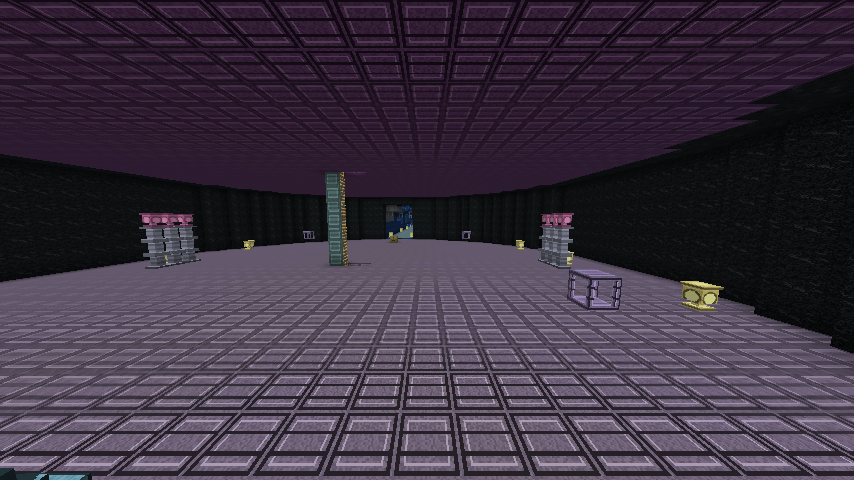
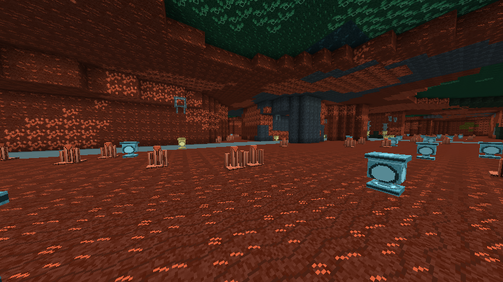

# 九层地下灵脉：生成与试炼

本阶段将已有的 81 种专属方块、29 种材料和加工设备接入落霞洞天的地下生成。九层岩层覆盖整个洞天的水平范围；玩家探索新区块时继续生成，无需在每次进入洞天时重新施工，也不会提前生成整张地图。

## 空间布局

主矿井入口位于洞天 `(0,73,160)`。连续梯井连接九层，底部水池缓冲坠落；每层设可落脚的矿站。保留 Y=-64 的基岩，以及地表 Y=63 的草地。

| 层 | 主题 | 矿道地板 Y | 主要灵石品质 |
| --- | --- | ---: | --- |
| 1 | 露泉 | 55 | 下品 |
| 2 | 霜晶 | 41 | 下品 |
| 3 | 苍蓝 | 27 | 中品 |
| 4 | 翠玉 | 13 | 中品 |
| 5 | 地火 | -1 | 上品 |
| 6 | 朱汞 | -15 | 上品 |
| 7 | 赤金 | -29 | 上品 |
| 8 | 紫髓 | -43 | 极品 |
| 9 | 地心 | -57 | 极品 |

每 128 格设置贯通矿道和交汇矿站，Z 轴以 160 为偏移；坐标计算涵盖负坐标，矿道跨区块衔接。矿站有照明、储物、工作台、加工设备和可坐下的座椅。其余空间由种子决定洞穴和岩层形状，包含专属矿石、可再生晶簇、地质原料，以及煤铁铜金、红石、青金石、钻石和绿宝石等常规资源。

晶簇生长在对应母岩上，成熟后右键采集并重新生长。矿石可进入已有的破碎、洗选、凝炼、冶炼与药液加工链，进一步供应灵石和炼丹材料；工作站及储物方块支持已有漏斗和 Forge 物品接口。

## Boss 房

第三、六、九层以 512×512 格为分区生成试炼房，半径分别为 20、23、26 格。九层中央地心房位于 `(0,-56,160)`，其余试炼随新区块继续分布。

房内包括封印门、共振启动台、战斗感应台、护柱和奖励缓存。对应钥匙右键北侧封印门可打开整扇 5×3 门；关门时检查是否夹住实体。普通自建封印门保留单块钥匙和红石行为。

| 层 | 试炼守卫 | 原版实体基础 | 最大生命 | 首次通关奖励 |
| --- | --- | --- | ---: | --- |
| 3 | 苍蓝晶卫 | 铁傀儡 | 160 | 中品灵石×8、苍蓝精矿×16、灵泉液×2 |
| 6 | 地火脉灵 | 烈焰人 | 220 | 上品灵石×8、朱汞精矿×16、灵泉液×2 |
| 9 | 地心封印卫 | 凋灵骷髅 | 320 | 极品灵石×4、地心精矿×16、灵泉液×2 |

靠近指定启动台并右键启动试炼，附近玩家可见 Boss 血条。和平难度无法启动。启动要求房间区块已加载，不会为召唤额外强制加载区块。Boss 使用原版成熟 AI，加上属性、仇恨和场地边界控制；当前版本没有新增专属 Boss 模型或多阶段技能。

每个房间记录 Boss UUID、通关和领奖状态。已激活房间不重复召唤，通关奖励只发一次。正常卸载保留试炼状态，未击败但被移除的守卫可重新启动。奖励放入缓存空槽；缓存已满或被拆除时掉在缓存位置，缓存区块尚未加载时延后发放。感应台可输出红石信号，普通共振台仍可作为红石开关使用。

## 新旧存档

- 新存档使用 `xiuxian:nine_layer_vein` 生成器，在区块地形生成阶段形成地下空间，随后照明并提供给玩家。
- 旧存档若保存了原来的平坦生成器，已有区块保持原样；新创建区块通过兼容处理接入灵脉。原中央矿井与旧 Boss 区域受保护。
- 兼容处理只替换新区块里的天然石头和深板岩，保留已有箱子、其他建筑方块和挖空空间。它发生在新区块首次加载后，与新存档的地形阶段生成不同。
- 不自动批量改造已探索区域。旧存档的新旧区域边缘可能有岩层断面，前往新探索区域即可找到完整九层布局。
- 洞天地上建筑仍由既有初始化流程生成，首次准备世界可能耗时；地下灵脉的接入不等于全部地上建筑也改成了区块地形生成。

## 定位和检查

没有新增路标或地图预设标记。洞天内可使用 `/xiuxian vein locate` 查看入口、最近矿站和分区试炼房坐标。

管理员可用 `/xiuxian vein visit <1..9>` 到达中央对应层，或 `/xiuxian vein boss <1..3>` 前往附近对应档位的启动台。Boss 传送会检查目的地是否已存在新试炼房，避免传入旧存档岩层。





## 验证

GameTest 覆盖九层资源与可采晶簇、正负坐标区块边界、远处首次生成、地表和玩家编辑保留、入口梯井、生成设备的方块实体、旧版新区块兼容、封印门、试炼重试以及一次性奖励。另运行既有资源交互和开局身份保护测试。

```powershell
.\gradlew.bat runGameTestServer build --console=plain '-PwithPack=true' '-PpackSide=server' '-PgameTestNamespaces=xiuxian_vein_gen,xiuxian_vein,xiuxian_startup'
python tools/audit_vein_assets.py
python tools/audit_vein_assets.py --jar build/libs/xiuxian-1.0.0-SNAPSHOT.jar
```

客户端实景检查使用复制的测试存档 `run/saves/vein-inspection`，可选预览参数为 `-PveinWorldPreview=true`；不会打开玩家存档。
